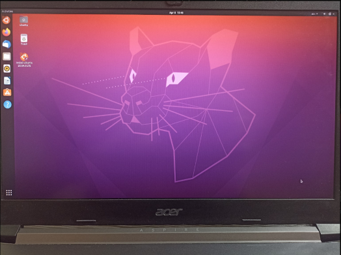
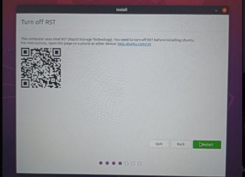
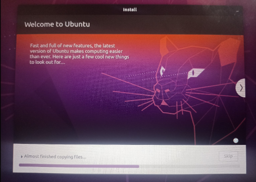
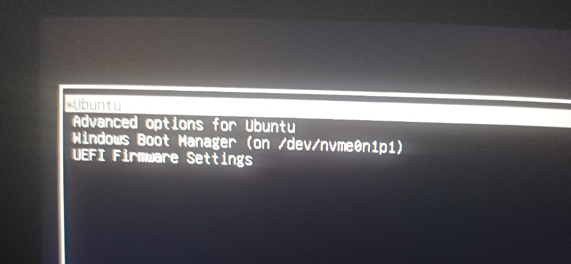
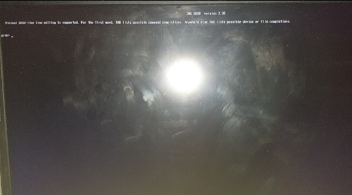
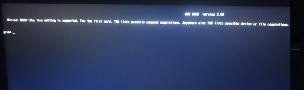

#  How to Create a Persistent Live USB (Ubuntu)

> This is a short manual on how to set up a **Persistent Live USB**, allowing you to run Ubuntu with saved files and settings on any device — portable and powerful.

---

## ⚠️ Warning

You may encounter problems when following the instructions. Please understand that things may look different on different devices from different manufacturers, so use ChatGPT and other tools to solve unexpected problems.
Also, before taking action, please read the instructions first!

---

## 📚 Structure of the Manual

- 1️⃣ Why Persistent Live USB?  
- 2️⃣ Hardware required  
- 3️⃣ Formatting and writing ISO to a flash drive using Rufus  
- 4️⃣ Ubuntu installation on second flash drive  
- 5️⃣ (Optional) Switch Intel RST to AHCI  
   *Skip this section if you’re only running Ubuntu from USB.*
- 6️⃣ Checking Ubuntu for functionality  
- 7️⃣ How to return to Windows OS again?  

---

## 1️⃣ Why Persistent Live USB?

There are several ways to run Ubuntu:

- Install it alongside Windows
- Use it in a virtual machine
- Run it as a **bootable USB**

But this tutorial teaches you how to create a **Persistent Live USB**.

With a Persistent Live USB:

- Ubuntu is **stored on your flash drive**
- You can **work on any device**, keeping files, programs, and settings
- You are **not dependent on any specific computer**
- It works **like a mini portable Linux system**

## Comparison: Bootable Flash vs Persistent USB

| Property                | Bootable Flash | Persistent USB |
|------------------------|----------------|----------------|
| Saves data             | ❌ No          | ✅ Yes         |
| Can install programs   | ❌ No          | ✅ Yes         |
| Used for installation  | ✅ Yes         | ✅ Yes         |
| Suitable for daily use | ❌ No          | ✅ Yes         |

As you can see, **Persistent Live USB is more powerful**, but it requires more time and effort to configure.

---
## 2️⃣ Hardware Required

To create a Persistent Live USB, you'll need:

 ###  Hardware Options
 - **Option A — single-stick setup**  
   • One USB drive ≥ 32 GB (Rufus/Ventoy can add a persistence partition).  
 - **Option B — two-stick setup (easier for beginners)**  
   • *Installer USB* ≥ 8 GB • *Main USB* ≥ 32 GB  
 - **Any PC/laptop that can boot from USB**

---

###  Example Configuration Used:

- **First Flash Memory:**  
  USB 2.0, 64GB, Apacer AH333 (can be even 16 GB, just enough for ISO file)

- **Second Flash Memory:**  
  64GB Kingston DataTraveler Exodia M, USB 3.2

- **Laptop:**  
  Acer Aspire 7, Core i7, 9th Gen  

---

### ⚠️ Important Recommendations:

- **Empty Drives:**  
  Make sure both flash drives are empty — all data will be erased.

- **USB Speed Matters:**  
  Use USB 3.0 or higher for the **second** flash drive (Ubuntu itself) to ensure fast installation and usage.

- **Storage Size:**  
  Avoid using flash drives below 32 GB — it will cause issues with saving files.  
  **Recommended size: 64 GB**

- **Durability Note:**  
  Running Ubuntu directly from a flash drive causes heat, which can reduce the flash drive’s lifespan.

---

## 3️⃣ Formatting and Writing ISO to a Flash Drive Using Rufus

First you need to prepare the first flash drive. For this purpose flash drive must be formatted and written with ISO file. You will have to download needed files and software in next steps.

---

**step 1)** **Insert First Flash Drive**  
Insert your first flash drive (for ISO only) into a USB port of your laptop or PC.

**step 2)** **Download Ubuntu ISO**  
Go to [Ubuntu Releases](https://releases.ubuntu.com/24.04/) and download the desired version (e.g., Ubuntu 24.04).

**step 3)** **Download Rufus**  
Go to [Rufus Official Website](https://rufus.ie/ru/) and download suitable for you version of **Rufus**.

**step 4)** **Launch Rufus**  
Open the Rufus software. You will see a window with device and boot selection options.

**step 5)** **Select Your first Flash Drive**  
In the **Device** field, choose your flash memory (for ISO).

**step 6)** **Select ISO File**  
After selecting in “Boot selection” please choose “Disk or ISO” option. 

**step 7)** Press button “Select” and find your ISO file (which you downloaded from website)

ℹ️ Leave other parameters as default unless you know what you're doing.

⚠️ **Attention:**  
**Rufus will format your flash drive completely!**  
Make sure there are no important files on it.

**step 8)** **Click start button**  
If you are sure click “Start” button. Please, make sure that you have constant power supply because upload interrupt may cause problems. Also, next window can appear and please select ISO image mode: 

.png)

**step 9)** Wait a few minutes on USB 3.x (up to ~15 min on older USB 2.0).  
When Rufus shows **READY**, your installer stick is done:
.png)

✅ First flash drive is now ready!

## 4️⃣ Ubuntu Installation on the Second Flash Drive

In this section we will install Ubuntu on the second flash drive.  
Please be patient as this is the longest and most complicated part of the manual.

---

 **Step 1)** Insert two flash drives in USB ports  
 **Step 2)** Please, turn your PC (or laptop) off and during power-up, press the Boot Menu key (depending on the model).  
 **Step 3)** When Boot menu is opened you can see several options. Please select your flash memory with ISO file of Ubuntu  
(in my case it was called just “Ubuntu”).  

.png)

After this you will see GRUB menu like this and select first option – Ubuntu.

 **Step 4)** When you clicked on your Ubuntu you will see this screen and please select “Try Ubuntu” option.

 .png)

 **Step 5)** After you selected “Try Ubuntu” option you will see next screen (it is desktop).  

 
 
 **Step 6)** Verify if laptop sees second flash drive (where we are going to install Ubuntu).  

For this purpose, find "Disks" (search via "Activities" → type Disks).  
There should be:  
- Your hard drive (500GB or similar)  
- USB stick with ISO image (first flash drive)  
- Your second flash drive (in my case 64GB Kingston) ← that's where we'll install Ubuntu.

 **Step 7)** Return to desktop. Click “Install Ubuntu 24.04 LTS” and in following windows choose next parameters:  
- Language — English  
- Keyboard layout  
- Connect Wi-Fi if you want.  

 

 **Step 8)** After you set up Wi-Fi settings you will see this screen (image below).  

 .png)
 
I chose normal installation with downloading updates.  
Click “Continue” after selecting suitable for you options.

**Step 9)** Choose **Erase disk and install Ubuntu**, select **your USB drive**, confirm → **Install now**.  
It wipes only the USB; your internal Windows disk stays intact.  

**Step 10)** After you click *Install now* the installer shows a summary window. You see how much memory you allocated for Ubuntu. Click “Continue” if you agree:

.png)

**Step 11)** After you clicked “Continue” it will ask your time zone. Please select your time zone. In my case I chose Almaty.

.png)

**Step 12)** Choose name, password and don’t forget them. Go “Continue” after you wrote down name and password. 

.png)

**Step 13)** After all was set up you will see screen of installation:

On a USB-3 stick the copy step usually takes **10–20 min** (longer on very slow USB-2 drives).

**Step 14)** After installation complete next window can appear:

.png)

Please, press “Restart now”.

**Step 15)** When you see “Remove the installation medium and press ENTER”:  
 1. Unplug **only** the installer USB.  
 2. **Keep** the main Ubuntu USB inserted.  
 3. Press **Enter** – the PC reboots into GRUB on that stick.

.png)

**Step 16)** After pressing Enter you will see GRUB menu:

Select Ubuntu. It is your Ubuntu installed to your second flash memory stick. 

✅ Installation has been completed!

---
## 5️⃣  (Optional) Disable Intel RST (AHCI switch)
*Usually not for a USB-only install.*  
RST only blocks **internal-disk** installs.  
If you later plan to dual-boot onto the laptop’s SSD, switch SATA mode to **AHCI** first; otherwise you can skip this step entirely.

**Step 1)** Please click “quit” (not restart) like in image:

.png)

**Step 2)** Turn off your laptop (PC)
**Step 3)** Open BIOS (press F2 during power-up)
**Step 4)** You will see information string like this (image below):

.png)

**Step 5)** Using arrows on your keyboard please select “Main”:
**Step 6)** Press Ctrl + S. This shortcut will reveal hidden parameters like SATA mode. 
**Step 7)** In SATA mode change "Optane without RAID" to “AHCI”.

✅ Now, you have turned RST mode off. You can continue Ubuntu installation

Return to desktop:
- Please turn laptop off
- open BIOS,
- select Ubuntu, 
- In GRUB menu select Ubuntu, 
- click “Try Ubuntu” to see desktop. 
- Do setting up again (language, keyboard layout, wifi)

---

## 6️⃣ Checking Ubuntu for functionality  

How to verify if my Ubuntu on second flash drive will work properly?

**Method 1**

- Please open “Files”. 
- Go in folder Documents or Desktop.
- Create any file (I created .txt file) and save it
- Turn off laptop
- Remove flash memory from your laptop
- Insert flash memory again
- Launch Ubuntu from GRUB menu.
- Open “Files” and verify if your created file is there. If yes flash memory with Ubuntu works properly. 

**Method 2**
- Also, you can check flash memory on working capability by connecting to WIFI network. If connects to it properly – your Ubuntu works. 

**Method 3**
- Also, you can check it by updates. Open terminal (Ctrl + Alt + T) and insert: 
sudo apt update && sudo apt upgrade
If system is being updated – your Ubuntu works properly.

**Method 4**
- You can download different programs. I successfully installed ROS with Gazebo and launched them. My flash drive worked.

---

## 7️⃣ How to return to Windows OS again?  

Most Windows 10/11 systems boot fine in **AHCI**.  
If Windows *does* fail, enter BIOS and switch **AHCI → Optane/RAID**, then be sure “Windows Boot Manager” is at the top of the boot list.

After you turned laptop off, removed flash memory with Ubuntu and powered it up you can receive this image (Grub rescue mode):

Just open BIOS menu, again find SATA mode option, change from “AHCI” to "Optane without RAID". This will help to load Windows OS properly. Shut down laptop and power it up again. After this you can again face with Grub rescue mode (look at image below):

Again, now you just need to:
- Turn off your laptop completely (hold the power button).
- Enter BIOS (on Acer, it's usually F2 during startup).
- Go to the Boot tab.
- Make sure Windows Boot Manager is first in the boot order.
If not — move it to the top using F5/F6.
- Save changes (F10, then Enter).
- Restart the laptop — Windows should boot up.

✅ This is the end of the instructions!

Made by: Adilet Toleshev, MS Student in Robotics (2025).

