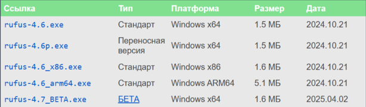
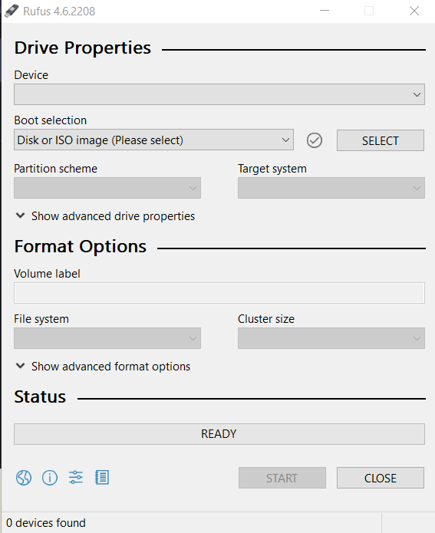

#  How to Create a Persistent Live USB (Ubuntu)

> This is a short manual on how to set up a **Persistent Live USB**, allowing you to run Ubuntu with saved files and settings on any device — portable and powerful.

---

## ⚠️ Warning

You may encounter problems when following the instructions. Please understand that things may look different on different devices from different manufacturers, so use ChatGPT and other tools to solve unexpected problems.
Also, before taking action, please read the instructions first!

---

## 📚 Structure of the Manual

- 1️⃣ Why Persistent Live USB?  
- 2️⃣ Hardware required  
- 3️⃣ Formatting and writing ISO to a flash drive using Rufus  
- 4️⃣ Ubuntu installation on second flash drive  
- 5️⃣ RST turning off  
- 6️⃣ Checking Ubuntu for functionality  
- 7️⃣ How to return to Windows OS again?  

---

## 1️⃣ Why Persistent Live USB?

There are several ways to run Ubuntu:

- Install it alongside Windows
- Use it in a virtual machine
- Run it as a **bootable USB**

But this tutorial teaches you how to create a **Persistent Live USB**.

With a Persistent Live USB:

- Ubuntu is **stored on your flash drive**
- You can **work on any device**, keeping files, programs, and settings
- You are **not dependent on any specific computer**
- It works **like a mini portable Linux system**

## Comparison: Bootable Flash vs Persistent USB

| Property                | Bootable Flash | Persistent USB |
|------------------------|----------------|----------------|
| Saves data             | ❌ No          | ✅ Yes         |
| Can install programs   | ❌ No          | ✅ Yes         |
| Used for installation  | ✅ Yes         | ✅ Yes         |
| Suitable for daily use | ❌ No          | ✅ Yes         |
| Resource usage         | 🟢 Low         | 🟡 Medium      |

As you can see, **Persistent Live USB is more powerful**, but it requires more time and effort to configure.

---
## 2️⃣ Hardware Required

To create a Persistent Live USB, you'll need:

### 🔧 Basic Requirements:
- **First flash memory** — For the Ubuntu ISO file (used only for installation).
- **Second flash memory** — For installing and running Ubuntu itself.
- **Laptop or PC** — Any device that supports booting from USB.

---

### 🧪 Example Configuration Used:

- **First Flash Memory:**  
  USB 2.0, 64GB, Apacer AH333 (can be even 16 GB, just enough for ISO file)

- **Second Flash Memory:**  
  64GB Kingston DataTraveler Exodia M, USB 3.2

- **Laptop:**  
  Acer Aspire 7, Core i7, 9th Gen  

---

### ⚠️ Important Recommendations:

- **Empty Drives:**  
  Make sure both flash drives are empty — all data will be erased.

- **USB Speed Matters:**  
  Use USB 3.0 or higher for the **second** flash drive (Ubuntu itself) to ensure fast installation and usage.

- **Storage Size:**  
  Avoid using flash drives below 32 GB — it will cause issues with saving files.  
  **Recommended size: 64 GB**

- **Durability Note:**  
  Running Ubuntu directly from a flash drive causes heat, which can reduce the flash drive’s lifespan.

---

## 3️⃣ Formatting and Writing ISO to a Flash Drive Using Rufus

First you need to prepare the first flash drive. For this purpose flash drive must be formatted and written with ISO file. You will have to download needed files and software in next steps.

---

**step 1)** **Insert First Flash Drive**  
Insert your first flash drive (for ISO only) into a USB port of your laptop or PC.

**step 2)** **Download Ubuntu ISO**  
Go to [Ubuntu Releases](https://releases.ubuntu.com/focal/) and download the desired version (e.g., Ubuntu 20.04).

**step 3)** **Download Rufus**  
Go to [Rufus Official Website](https://rufus.ie/ru/) and download suitable for you version of **Rufus**.

**step 4)** **Launch Rufus**  
Open the Rufus software. You will see a window with device and boot selection options.

**step 5)** **Select Your first Flash Drive**  
In the **Device** field, choose your flash memory (for ISO).

**step 6)** **Select ISO File**  
After selecting in “Boot selection” please choose “Disk or ISO” option. 

**step 7)** Press button “Select” and find your ISO file (which you downloaded from website)

ℹ️ Leave other parameters as default unless you know what you're doing.

⚠️ **Attention:**  
**Rufus will format your flash drive completely!**  
Make sure there are no important files on it.

**step 8)** **Click start button**  
If you are sure click “Start” button. Please, make sure that you have constant power supply because upload interrupt may cause problems. Also, next window can appear and please select ISO image mode: 

.png)

**step 9)** **Click start button** Wait for nearly 15-20 minutes. After formatting, Rufus will upload your ISO Ubuntu file inside flash memory and you will have this window:

.png)

✅ First flash drive is now ready!

## 4️⃣ Ubuntu Installation on the Second Flash Drive

In this section we will install Ubuntu on the second flash drive.  
Please be patient as this is the longest and most complicated part of the manual.

---

 **Step 1)** Insert two flash drives in USB ports  
 **Step 2)** Please, turn your PC (or laptop) off and during power-up, press the Boot Menu key (depending on the model).  
 **Step 3)** When Boot menu is opened you can see several options. Please select your flash memory with ISO file of Ubuntu  
(in my case it was called just “Ubuntu”).  

After this you will see GRUB menu like this and select first option – Ubuntu.

 **Step 4)** When you clicked on your Ubuntu you will see this screen and please select “Try Ubuntu” option.

---

 **Step 5)** After you selected “Try Ubuntu” option you will see next screen (it is desktop).  
 **Step 6)** Verify if laptop sees second flash drive (where we are going to install Ubuntu).  

For this purpose, find "Disks" (search via "Activities" → type Disks).  
There should be:  
- Your hard drive (500GB or similar)  
- USB stick with ISO image (first flash drive)  
- Your second flash drive (in my case 64GB Kingston) ← that's where we'll install Ubuntu.

---

 **Step 7)** Return to desktop. Click “Install Ubuntu 20.04 LTS” and in following windows choose next parameters:  
- Language — English  
- Keyboard layout  
- Connect Wi-Fi if you want.  

If after Wi-Fi connection you see this (image on the right), please look at section called “RST turning off”.  
If not, please continue following instructions.

---

 **Step 8)** After you set up Wi-Fi settings you will see this screen (image on the right).  
I chose normal installation with downloading updates.  
Click “Continue” after selecting suitable for you options.
